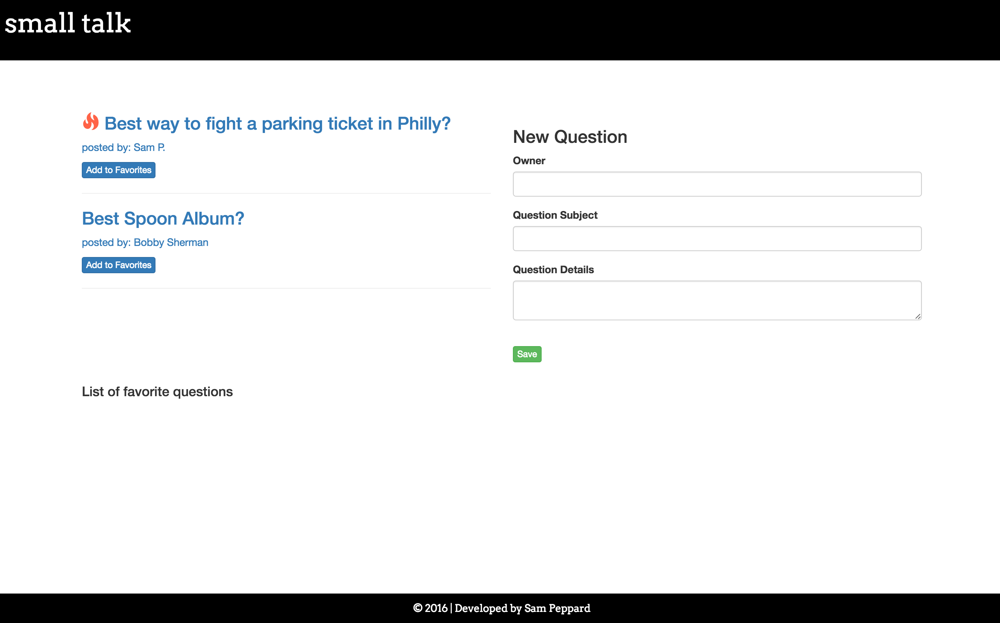

# *Small Talk*

##### A project built with Ember.js. 11.15.2016
#
##### By [Sam Peppard](https://github.com/sampeppard)
#

----
### **Description**

An application meant to start up small conversation topics where any user can contribute to a topic. There is a response limit to each topic in order to keep the topics in the realm of "small talk."

----
### **Specifications**
| _Behavior_ | _Input_ | _Output_ |
|:---------------------------------------------------------------------:|:---------------------------------------------------------------------------:|:-------------------------------------------------------------------------------------------------------------------:|
| Enter a topic/question | New question: Best way to make fajitas | Result: "i'm looking for the best way to make fajitas, any suggestions?" |
| Enter topic/question's author | Question's author: Bob Sherman | Result: author: Bob Sherman |
| Enter question details | Enter any details or notes about question: "i'm looking to make these fajitas on the cheap!" | Result: notes: "i'm looking to make these fajitas on the cheap!" |
| View logged questions/topics | Select question/topic | edit a question/topic's content, author or details |

----
### **Technologies Used**

* HTML
* CSS
* JavaScript
* Ember.js
* Handlebars.js
* Broccoli.js
* Bootstrap
* npm JS package manager
* Bower package manager
----

## Prerequisites

You will need the following things properly installed on your computer.

* [Git](http://git-scm.com/)
* [Node.js](http://nodejs.org/) (with NPM)
* [Bower](http://bower.io/)
* [Ember CLI](http://ember-cli.com/)
* [PhantomJS](http://phantomjs.org/)

## Installation

* `git clone <repository-url>` this repository
* `cd message-board-app`
* `npm install`
* `bower install`

## Running / Development

* `ember serve`
* Visit your app at [http://localhost:4200](http://localhost:4200).

### Code Generators

Make use of the many generators for code, try `ember help generate` for more details

### Running Tests

* `ember test`
* `ember test --server`

### Building

* `ember build` (development)
* `ember build --environment production` (production)

### Deploying

Specify what it takes to deploy your app.

## Further Reading / Useful Links

* [ember.js](http://emberjs.com/)
* [ember-cli](http://ember-cli.com/)
* Development Browser Extensions
  * [ember inspector for chrome](https://chrome.google.com/webstore/detail/ember-inspector/bmdblncegkenkacieihfhpjfppoconhi)
  * [ember inspector for firefox](https://addons.mozilla.org/en-US/firefox/addon/ember-inspector/)

### **Known Bugs**

No known bugs.

----
### **Support and contact details**

For comments or questions, please email sampeppard@gmail.com

----
### **License**

MIT
